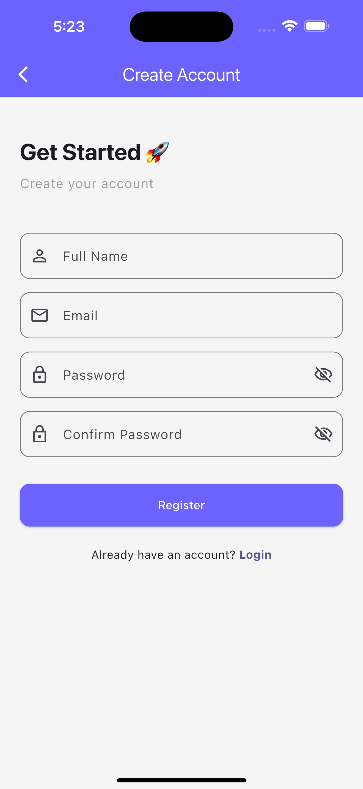
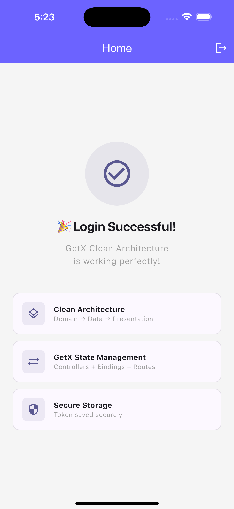

# 🏗️ Flutter GetX Clean Architecture

A production-ready Flutter boilerplate using **GetX** and **Clean Architecture** principles. Built for developers who want a scalable, maintainable, and testable Flutter app structure.


---

## ✨ Features

- ✅ Clean Architecture (Domain → Data → Presentation)
- ✅ GetX State Management
- ✅ GetX Navigation & Routing
- ✅ GetX Dependency Injection
- ✅ Dio + Auth Interceptor
- ✅ Secure Token Storage
- ✅ Auth Middleware (Route Guard)
- ✅ Light / Dark Theme
- ✅ Form Validation
- ✅ Error Handling (dartz Either)
- ✅ Working Auth Example (Login + Register)

---

## 📸 Screenshots

| Login | Register | Home |
|-------|----------|------|
|  |  |  |

---

## 🏛️ Architecture

lib/
├── app/
│   ├── data/
│   │   ├── models/          # JSON parsing, toEntity()
│   │   ├── providers/       # Dio API calls
│   │   └── repositories/    # Abstract impl
│   ├── domain/
│   │   ├── entities/        # Pure Dart classes
│   │   ├── repositories/    # Abstract contracts
│   │   └── usecases/        # Business logic
│   ├── modules/
│   │   ├── auth/
│   │   │   ├── bindings/    # DI setup
│   │   │   ├── controllers/ # GetX controllers
│   │   │   └── views/       # UI screens
│   │   └── home/
│   └── routes/              # App pages & routes
└── core/
├── constants/            # App constants & routes
├── middleware/           # Auth route guard
├── network/              # Dio client & exceptions
├── storage/              # Secure storage service
├── theme/                # Light & dark theme
└── utils/                # Helper functions

---

## 🚀 Getting Started

### Prerequisites

- Flutter SDK 3.x
- Dart SDK 3.x
- Android Studio / VS Code

### Installation

**1. Clone the repo**
```bash
git clone https://github.com/yourusername/flutter_getx_clean_starter.git
cd flutter_getx_clean_starter
```

**2. Install dependencies**
```bash
flutter pub get
```

**3. iOS setup (Mac only)**
```bash
cd ios && pod install && cd ..
```

**4. Configure API**

Open `lib/core/constants/app_constants.dart`:
```dart
static const String baseUrl = 'https://your-api-url.com/api/v1';
```

**5. Run the app**
```bash
flutter run
```

---

## 📦 Dependencies

| Package | Version | Purpose |
|---------|---------|---------|
| get | ^4.6.6 | State management, navigation, DI |
| dio | ^5.4.0 | HTTP client |
| flutter_secure_storage | ^9.0.0 | Secure token storage |
| dartz | ^0.10.1 | Functional error handling |
| equatable | ^2.0.5 | Value equality |
| flutter_screenutil | ^5.9.0 | Responsive UI |

---

## 🔐 Auth Flow

App Start
↓
StorageService.init()
↓
isLoggedIn?
↓           ↓
YES           NO
↓           ↓
Home         Login
Screen       Screen
↓           ↓
Logout      Fill Form
↓           ↓
Clear       API Call
Token           ↓
↓       Save Token
Login           ↓
Screen      Home Screen

---

## 🧩 How to Add a New Module

**1. Create folders**
```bash
mkdir -p lib/app/modules/product/bindings
mkdir -p lib/app/modules/product/controllers
mkdir -p lib/app/modules/product/views
```

**2. Add route in `app_routes.dart`**
```dart
static const String product = '/product';
```

**3. Add page in `app_pages.dart`**
```dart
GetPage(
  name: AppRoutes.product,
  page: () => const ProductView(),
  binding: ProductBinding(),
),
```

**4. Follow same pattern as Auth module** ✅

---

## 🤝 Contributing

Contributions are welcome! Please feel free to submit a Pull Request.

1. Fork the project
2. Create your feature branch (`git checkout -b feature/AmazingFeature`)
3. Commit your changes (`git commit -m 'Add AmazingFeature'`)
4. Push to the branch (`git push origin feature/AmazingFeature`)
5. Open a Pull Request

---

## 📄 License

Distributed under the MIT License. See `LICENSE` for more information.

---

## ⭐ Show Your Support

If this project helped you, please give it a **star** ⭐ on GitHub!

---

## 📬 Connect

Made with ❤️ by [Sunny Singh](https://github.com/flutterbysunny)

[](https://github.com/yourusername)


